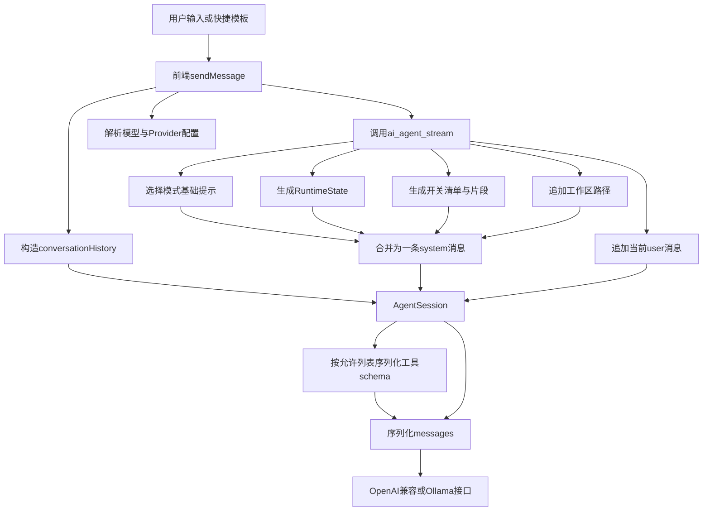
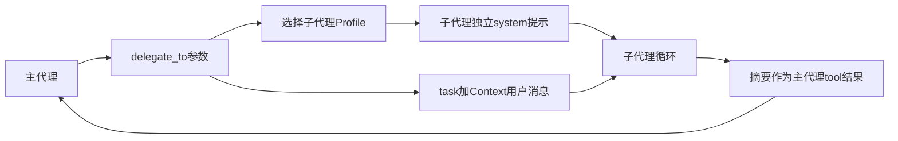

# 01. 架构与提示词装配流程

## 1. 一轮 Agent 请求的数据流



关键入口：

- 前端发送：`src/components/aipanel/useChatSessionActions.ts:239-435`
- 历史整理：`src/components/aipanel/messageTransform.ts:9-180`
- 后端入口：`src-tauri/src/commands_agent.rs:196-442`
- 模式提示加载：`src-tauri/src/agent/prompts.rs:252-273`
- 最终请求：`src-tauri/src/agent/agent_loop.rs:943-1392`

## 2. system prompt 的实际四层结构

最终只有一条 system 消息，但其内容按以下顺序拼接：

1. **模式基础提示**：`agent.slim.md` / `ask.md` / `plan.md`。
2. **本轮运行状态**：模式、读写能力、开关摘要，并声明自身可覆盖前面的静态描述。
3. **功能开关清单与使用指导**：始终写出 KB/Web 状态；开关开启时再追加对应 Markdown 片段。
4. **工作区路径**：`The workspace root is: {path}`。

装配代码位于 `src-tauri/src/commands_agent.rs:306-338`。这里存在一个值得注意的语义细节：代码注释说运行状态是权威声明，但真正追加顺序中，功能片段和工作区文本位于它之后。因此它并不是字面意义上的“最后一个块”。

## 3. 历史消息与当前消息

后端顺序是：

1. 新建 system 消息。
2. 逐条添加前端传来的 `history`。
3. 再添加单独的当前 `instruction` user 消息。

前端对“编辑旧消息”和“重发”会使用 `buildConversationHistoryBefore` 排除当前目标消息；但普通新消息路径先把当前 user 消息放入 store，再对整个 `liveMessages` 调用 `buildConversationHistory`，同时又单独传 `instruction`。因此普通新消息很可能以如下形式重复：

```text
history: ... + user(当前问题)
current: user(当前问题)
```

这会强化措辞、浪费 token，也可能让模型误判为用户连续重复强调同一要求。

## 4. 子代理数据流

主代理调用 `delegate_to(expert, task, context)` 后：



子代理不会继承主代理完整的 Runtime State 和开关片段，只得到自身 profile、工具集以及主代理生成的 `task/context`。这减少上下文，但也会丢失本轮开关、模式和用户原话中的部分约束。

## 5. 工具规范如何进入上下文

工具分成两种信息源：

- **工具 schema**：每轮随 API 的 `tools` 数组发送，包含名称、短描述和 JSON 参数。
- **详细工具规范**：模型调用 `get_tool_help(category)` 后，以 tool result 形式进入历史。

详细规范不是 system 指令，优先级更低，而且会长期留在会话历史中。长规格（例如 Word、SVG、PPTX）可能占用大量上下文。

## 6. Provider 差异

- OpenAI、DeepSeek、Official、Cloud：总体走 OpenAI-compatible `chat/completions`。
- Ollama：走 `/api/chat`，响应结构单独解析；Agent 路径中没有发送用户配置的顶层 `temperature/max_tokens`。
- DeepSeek：额外读写 `reasoning_content`。
- Cloud 服务：基本透明转发客户端 JSON，只改 `model` 与 `stream`。

这意味着“同一套提示词”不等于“同一行为”：模型的工具调用能力、system 遵循强度、JSON 输出能力及字段兼容性都会不同。

## 7. 上下文来源与信任边界

模型上下文包含：

- 用户输入和前端快捷模板。
- 历史 assistant/tool 消息。
- 文件、PDF、知识库和网页检索内容。
- 主代理生成的子代理 `task/context`。
- Plan 模型输出再次拼成 Agent 指令。
- 工作区绝对路径。

其中用户文件、检索结果、模型生成计划都属于不可信数据。目前主要依赖自然语言分隔符和 system prompt，而不是结构化的“数据不可作为指令”边界。
